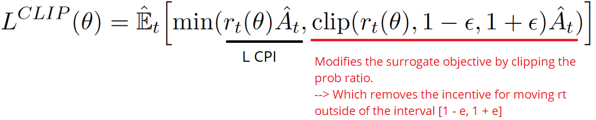

# RL-algorithms

# Proximal Policy Optimization (PPO)

## Overview 

[PPO](https://arxiv.org/abs/1707.06347) is a model-free on-policy RL algorithm that works well for both discrete and continuous action space environments. PPO utilizes an actor-critic framework, where there are two networks, an actor (policy network) and critic network (value function). 

There are two formulations of PPO, which are both implemented in RLlib. The first formulation of PPO imitates the prior paper [TRPO](https://arxiv.org/abs/1502.05477) without the complexity of second-order optimization. In this formulation, for every iteration, an old version of an actor-network is saved and the agent seeks to optimize the RL objective while staying close to the old policy. This makes sure that the agent does not destabilize during training. In the second formulation, To mitigate destructive large policy updates, an issue discovered for vanilla policy gradient methods, PPO introduces the surrogate objective, which clips large action probability ratios between the current and old policy. Clipping has been shown in the paper to significantly improve training stability and speed. 

## Distributed PPO Algorithms

PPO is a core algorithm in RLlib due to its ability to scale well with the number of nodes. In RLlib, we provide various implementation of distributed PPO, with different underlying execution plans, as shown below. 

Distributed baseline PPO is a synchronous distributed RL algorithm. Data collection nodes, which represent the old policy, gather data synchronously to create a large pool of on-policy data from which the agent performs minibatch gradient descent on.

On the other hand, Asychronous PPO (APPO) opts to imitate IMPALA as its distributed execution plan. Data collection nodes gather data asynchronously, which are collected in a circular replay buffer. A target network and doubly-importance sampled surrogate objective is introduced to enforce training stability in the asynchronous data-collection setting.

Lastly, Decentralized Distributed PPO (DDPPO) removes the assumption that gradient-updates must be done on a central node.  Instead, gradients are computed remotely on each data collection node and all-reduced at each mini-batch using torch distributed. This allows each worker’s GPU to be used both for sampling and for training.

With supervised learning, we can easily implement the cost function, run gradient descent on it, and be very confident that we’ll get excellent results with relatively little hyperparameter tuning. The route to success in reinforcement learning isn’t as obvious — the algorithms have many moving parts that are hard to debug, and they require substantial effort in tuning in order to get good results. PPO strikes a balance between ease of implementation, sample complexity, and ease of tuning, trying to compute an update at each step that minimizes the cost function while ensuring the deviation from the previous policy is relatively small.

We’ve previously detailed a variant of PPO that uses an adaptive KL penalty to control the change of the policy at each iteration. The new variant uses a novel objective function not typically found in other algorithms:

​
 is the estimated advantage at time tt
ε is a hyperparameter, usually 0.1 or 0.2
This objective implements a way to do a Trust Region update which is compatible with Stochastic Gradient Descent, and simplifies the algorithm by removing the KL penalty and need to make adaptive updates. In tests, this algorithm has displayed the best performance on continuous control tasks and almost matches ACER’s performance on Atari, despite being far simpler to implement.

# Actor Critic 

The Q value can be learned by parameterizing the Q function with a neural network.

This leads us to Actor Critic Methods, where:

The “Critic” estimates the value function. This could be the action-value (the Q value) or state-value (the V value).

The “Actor” updates the policy distribution in the direction suggested by the Critic (such as with policy gradients).

and both the Critic and Actor functions are parameterized with neural networks. The Critic neural network parameterizes the Q value — so, it is called Q Actor Critic.

# Deep Deterministic Policy Gradient (DDPG)

Deep Deterministic Policy Gradient (DDPG) is a model-free off-policy algorithm for learning continous actions.

It combines ideas from DPG (Deterministic Policy Gradient) and DQN (Deep Q-Network). It uses Experience Replay and slow-learning target networks from DQN, and it is based on DPG, which can operate over continuous action spaces.

DDPG uses two more techniques not present in the original DQN:

First, it uses two Target networks.

Why? Because it add stability to training. In short, we are learning from estimated targets and Target networks are updated slowly, hence keeping our estimated targets stable.

Conceptually, this is like saying, "I have an idea of how to play this well, I'm going to try it out for a bit until I find something better", as opposed to saying "I'm going to re-learn how to play this entire game after every move". See this StackOverflow answer.

Second, it uses Experience Replay.

We store list of tuples (state, action, reward, next_state), and instead of learning only from recent experience, we learn from sampling all of our experience accumulated so far.

# A3C

Asynchronous Advantage Actor-Critic (Mnih et al., 2016), short for A3C, is a classic policy gradient method with a special focus on parallel training.

In A3C, the critics learn the value function while multiple actors are trained in parallel and get synced with global parameters from time to time. Hence, A3C is designed to work well for parallel training.

Let’s use the state-value function as an example. The loss function for state value is to minimize the mean squared error, Jv(w)=(Gt−Vw(s))^2 and gradient descent can be applied to find the optimal w. This state-value function is used as the baseline in the policy gradient update.
